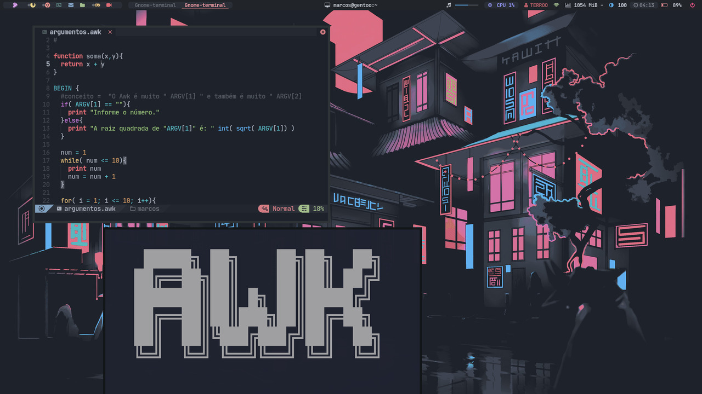

# dotfiles
My Polybar and others setup for BSPWM on Linux
> This repository was based on the dotfiles from **siduck76** more precisely from the repository: <https://github.com/siduck76/dotfiles>



# Dependencies
+ [bspwm](https://github.com/baskerville/bspwm)
+ [polybar](https://github.com/polybar/polybar)
+ [fonts](https://github.com/terroo/fonts) `rm -rf ~/.local/share/fonts`
+ [git](https://git-scm.com)
+ [feh](https://feh.finalrewind.org/) 
+ [Lua](https://www.lua.org/)
+ [wmctrl](http://tripie.sweb.cz/utils/wmctrl/) `sudo apt install wmctrl`
> Most of the dependencies mentioned above were made in this video: <https://www.youtube.com/watch?v=CivY-yfRBeY>

# Installation
```sh
git clone https://github.com/terroo/dotfiles
cd dotfiles
```

Backup your Polybar if you already had it
```sh
tar -zcvf polybar-old.tar.gz ~/.config/polybar
```

Move(and/or remove) files
```sh
rm -rf ~/.config/polybar
mv polybar $HOME/.config
mv Xresources $HOME/.Xresources
```

# Configurations
Add to your `$HOME/.config/bspwm/bspwmrc`:
```sh
xrdb ${HOME}/.Xresources
$HOME/.config/polybar/launch.sh &
$HOME/.fehbg
```

Run:
```sh
mv wallpaper.jpg ~/Pictures
feh --bg-scale ~/Pictures/wallpaper.jpg
```

Change the Gentoo icon according to your system, see all available icons by running the file:
```sh
lua systems-icons.lua
```


If you want, change the name TERROO to your name, for example:
```sh
sed -i "s/TERROO/$USER/g" ~/.config/polybar/config
```
> If you want also remove the `keyboard` from the bar

If you want the music tracks to appear in the bar when you run MPD, check this video: <https://www.youtube.com/watch?v=tholV10zDi0>

Log out and start again
```sh
bspc quit
```

# Watch Video
[](https://www.youtube.com/watch?v=5UHDruEz7dI)

